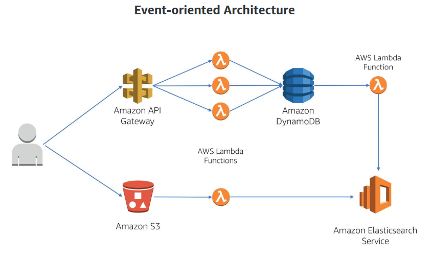
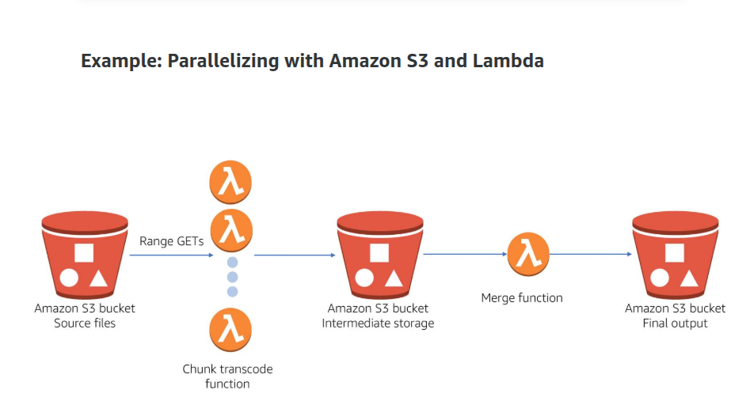

# Serverless Mindset: 

### what is a serverless architecture: 
- No managing instances/servers: users need not manage instances, manage OS patches and runtime environments
- Flexible scaling 
- Automated High-availability
- No idle capacity

### Advantages: 
- Lower costs : No idle capacity
- No need for management : saves management efforts by automating configuration and server management, automates deployments and more. 
- Reduced time to market: easier and faster to deploy applications serverlessly

# Tools: 
- Lambda Functions 
- Pywren 
- S3 
- SNS 
- SQS 
- Step Functions 

### Building Serverless applications:
- event driven 

- Parallelization: 

