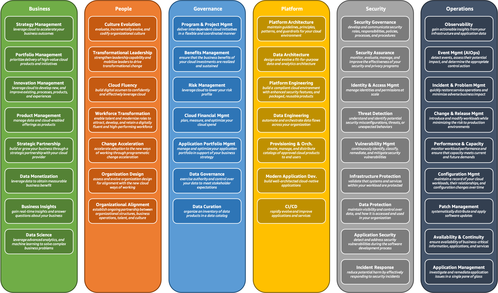

# Topics:
- Cloud adoption framework 
- AWS WAF 
- Elastic Load Balancer
- Auto Scaling Group
- Launch templates
- VPC 

# [Cloud adoption framework](https://aws.amazon.com/what-is/cloud-adoption-framework/)
- Frame work for transition from On-prem to cloud.
- Need for CAF:
    + Reduce Business Risk (Data security, prevent downtime, interruptions)
    + Accelerate innovation: Allows users to move to the cloud faster and leverage its benefits in a better way. 
    + Agility : provides business with a clear highly structured aproach to Transition/ 
- Use cases: 
    + Helps organize resources in such a way that uses agile methods to allow the organization to become more customer centric and responsive.
    + Techbology adaption: A CAF can help you migrate and modernize your legacy infrastructure and applications plus data and analytics technologies for enhanced operational efficiency
    + process improvement: Cloud architecture can create a secure foundation that reduces operational costs while providing a higher degree of reliability. 

# **Key Capabilities of a Cloud Adoption Framework (CAF)**  

A Cloud Adoption Framework (CAF) provides structured guidance to help organizations transition to the cloud efficiently while ensuring security, governance, and business alignment. The framework defines several key capabilities, which represent the essential areas that organizations must develop to succeed in their cloud journey. These capabilities are categorized into six main domains:

---

## **1. Business Capability**  
**Focus:** Aligning cloud adoption with business goals and strategies.  
**Key Stakeholders:** CEOs, CFOs, COOs, CIOs, CMOs, CPOs, CTOs  

### **Key Aspects:**  
- **Cloud Strategy & Product Management** – Ensures cloud investments support business growth.  
- **Business Insights** – Uses cloud-driven analytics to inform strategic decisions.  
- **Portfolio Management** – Manages cloud-based applications and services effectively.  
- **Strategic Partnerships** – Collaborates with cloud vendors and partners for business growth.  
- **Data Science & Monetization** – Leverages cloud-driven data to unlock new revenue opportunities.  
- **Innovation Management** – Drives new digital innovations using cloud technologies.  

> **Why It Matters:** Business leaders use this capability to ensure that cloud adoption aligns with strategic objectives and delivers measurable ROI.

---

## **2. People Capability**  
**Focus:** Managing the workforce and cultural transformation required for cloud adoption.  
**Key Stakeholders:** CIOs, COOs, CTOs, CHROs, Cloud Directors  

### **Key Aspects:**  
- **Culture Evolution** – Encourages a mindset shift toward cloud-first thinking.  
- **Workforce Transformation** – Upskills employees for cloud roles and responsibilities.  
- **Transformational Leadership** – Enables leadership to drive cloud adoption.  
- **Change Acceleration** – Helps employees adapt quickly to cloud-related changes.  
- **Organizational Alignment** – Ensures teams work towards cloud objectives collaboratively.  
- **Cloud Fluency** – Provides training to increase expertise in cloud technologies.  
- **Organizational Design** – Restructures teams to optimize cloud operations.  

> **Why It Matters:** Cloud transformation is not just a technology shift—it requires an organizational and cultural change that must be actively managed.

---

## **3. Governance Capability**  
**Focus:** Establishing cloud governance, financial management, and risk mitigation.  
**Key Stakeholders:** CIOs, CTOs, CFOs, CROs, CDOs  

### **Key Aspects:**  
- **Program & Project Management** – Defines structured processes for cloud adoption.  
- **Cloud Financial Management** – Monitors and optimizes cloud costs.  
- **Benefits Management** – Tracks cloud adoption impact on business objectives.  
- **Application Portfolio Management** – Organizes and modernizes cloud-based applications.  
- **Data Curation & Governance** – Ensures proper management and compliance of data.  
- **Risk Management** – Identifies and mitigates potential risks related to cloud adoption.  

> **Why It Matters:** Governance ensures that cloud adoption is controlled, secure, and cost-effective, preventing financial waste and security vulnerabilities.

---

## **4. Platform Capability**  
**Focus:** Developing a scalable, reliable cloud infrastructure.  
**Key Stakeholders:** Technology Leaders, CTOs, Architects, Engineers  

### **Key Aspects:**  
- **Platform Architecture & Engineering** – Designs cloud environments that meet business needs.  
- **Data Architecture & Engineering** – Establishes data management best practices.  
- **Provisioning & Orchestration** – Automates cloud resource deployment and scaling.  
- **Modern Application Development** – Adopts cloud-native application development practices.  
- **Continuous Integration & Continuous Delivery (CI/CD)** – Implements DevOps pipelines for faster software deployment.  

> **Why It Matters:** A well-designed platform ensures cloud applications are scalable, resilient, and optimized for performance.

---

## **5. Security Capability**  
**Focus:** Ensuring data integrity, confidentiality, and security compliance in the cloud.  
**Key Stakeholders:** CISOs, Security Architects, Engineers, Internal Audit Leaders, CCOs  

### **Key Aspects:**  
- **Security Governance & Assurance** – Establishes security policies and best practices.  
- **Identity & Access Management (IAM)** – Controls user permissions and access.  
- **Vulnerability Management** – Detects and remediates security flaws.  
- **Infrastructure Protection** – Secures cloud networks, servers, and storage.  
- **Data Protection** – Ensures encryption, backup, and compliance measures are in place.  
- **Application Security** – Protects applications from cyber threats.  
- **Threat Detection & Response** – Monitors for and mitigates security threats.  

> **Why It Matters:** Security is critical for protecting sensitive data, maintaining compliance, and ensuring business continuity.

---

## **6. Operations Capability**  
**Focus:** Managing cloud services efficiently to meet business and technical requirements.  
**Key Stakeholders:** IT Service Managers, Site Reliability Engineers (SREs), Infrastructure & Operations Leaders  

### **Key Aspects:**  
- **Observability** – Provides insights into cloud system health and performance.  
- **Event Management (AIOps)** – Uses AI-driven automation for incident detection and resolution.  
- **Incident & Problem Management** – Ensures quick response to service disruptions.  
- **Change & Release Management** – Coordinates updates and deployments efficiently.  
- **Performance & Capacity Management** – Ensures systems are optimized for demand.  
- **Configuration Management** – Maintains consistency in cloud environments.  
- **Patch Management** – Applies security and software updates systematically.  
- **Availability & Continuity** – Implements disaster recovery and backup strategies.  
- **Application Management** – Oversees the operation and maintenance of cloud applications.  

> **Why It Matters:** Efficient operations management ensures that cloud services remain available, performant, and cost-effective.

---

# [well architected framework](https://docs.aws.amazon.com/wellarchitected/latest/framework/)

The AWS Well-Architected Framework describes key concepts, design principles, and architectural best practices for designing and running workloads in the cloud. By answering a few foundational questions, learn how well your architecture aligns with cloud best practices and gain guidance for making improvements.

### Six pillars:
- Operational Excellence Pillar 
- Security Pillar 
- Reliability Pillar 
- operational excellence pillar
- Cost Optimization pillar
- Sustainability pillar. 

# Elastic load balancer:
- Balances requests between multiple servers
- ELB will have **singular DNS name** 
- Routes traffic to servers 
- Created at a regional Level 
- Balances requests between servers in diffrent AZs 
- Performs health checks to ensure that servers are performing
- If a server fails or gets terminated ELB does not create new instances or spin instances back up.
- in case of faliure, requests are directed to other servers. 

### Types of load balancer: 
- Network Load balancer: works on layer 4 of osi model
    + ideal for content based load balancing
    + webapplication 
    + micro-services
- Application load balancer: works of layer 7 of OSI model
    + good for low latency applications
    + High throughput applications
- Classic load balancer: works on layer 4 and layer 7
    + best for basic Load balancing
    + Not recommended for modern applications

other topics:
- cloud front 
- WAF 
- Global ELB 

# Auto Scaling group:
- Maintains a certain number of instances running at all times. 
- Creates and terminates instances on the basis of CPU/memory/network utilization 
- Can also be scheduled to increase number of instances at specific times. 
- One can provide a minimum and maximum number of instances 
- and a base number of instances 
- It is also possible to scale on the basis of cloud front metrics (cpu utilization, network utilization and more)
- if an instance enters an unhealthy state a new instances is created to replace it. 
- you must create an instance template before creating an autoscaling group. 

