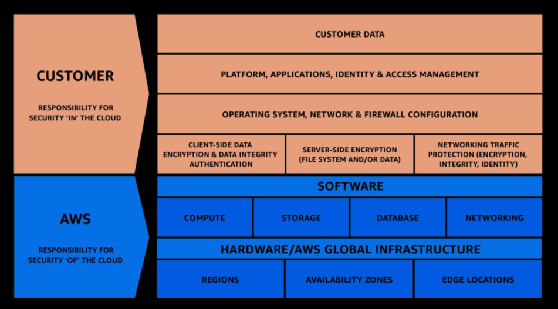
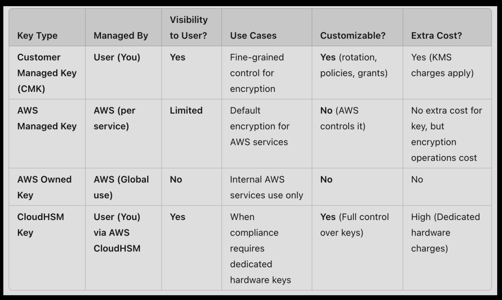

# Topics Covered: 
- AWS shared responsibility model
- DDoS Attacks
- AWS WAF 
- AWS Network Firewall
- Penetration Testing
- Key management Service
- AWS Certificate manager

# AWS Responsibilities:
- protecting harware
- protecting software (ELBs, System managers, managed service software)
- Network security

# User Responsibility: 
- manage the software running on instances
- manage IAM roles 
- manage system security & keys 

## Shared Responsibilty model for RDS:

### AWS responsibility: 
- managing underlying EC2 instances 
- disabling ssh access 
- automated DB patching 
- automated os patching 
- audit underlying infrastructure, ensure availability

### User responsibility:
- Managing IAM access 
- managing DB security group(inbound and outbount rule)
- DB privacy -> public/private subnet
- Database encryption

## Shared Responsibility for S3:
 
### AWS responsibilites: 
- Storage space 
- implementing bucket encryption  
- ensuring bucket privacy from aws employees 
- seperation of data
### User responsibilities:
- bucket config
- bucket public/private setting 
- IAM and user roles 
- enabling encryption 

# DDoS attacks:
- DDoS attacks work by overwhelming servers with requests from a number of locations(IPs)
- DDoS can be costly if auto-scaling is configured.

## DDoS protection:
- AWS Shield (Free): standard DDoS attack protection, provides notifications, no additional cost, protects against layer 3,4 attacks(SYN, UDP)
- AWS shield (Advanced) : Advanced 24/7 protection, $3K / month, DDoS response team
- AWS WAF : filter requests based on certain rules (type of requests, count of requests, rate of requests, etc)
- Cloud Front : provides attack mitigation at the edge
- Auto-scaling: Increase compute to ensure availability even with malicious requests

# AWS Web-application-firewall(WAF):
- protects against layer 7 exploits
- deployed on ALB, CloudFront, API gateway 
- Define access control list:
    + rules can be based on IP, Method, header, body, URI
    + protects against SQL-injections, XSS 
    + request size constraints, geoblock
    + rate based rules

# Network Firewall:
- protect VPC (layer 3-7)
- inspect all types of traffic(VPC - VPC, INTRNT - VPC, VPC - INTRNT, etc)

### Firewall Manager:
- manage security rules in all accs of a AWS org
- security policy: 
    + VPC SGs(EC2, S3, etc)
    + WAF rules 
    + AWS Network Firewall 
- Rules are implemented on new resources as they are created, ensures compliance even with increasing accs

# Penetration Testing:
- Penetration testing can be performed agains a set of services without permission from AWS
    + EC2, WAF, NAT, ELB
    + RDS
    + CDN 
    + Aurora
    + API Gateways 
    + AppSync 
    + Lambda, Lambda Edge func 
    + Lightsail
    + Elastic Beanstalk
    + Elastic Container Service
    + Fargate 
    + OpenSearchService 
    + FSx
    + Transit Gateway 
    + S3 hosted applications
- Following activities are prohibited: 
    + DNS Fuckery 
    + S3 buckets 
    + any kind of DoS
    + Protocol Flooding
    + Request flooding

# AWS Key management Service(KMS):
- AWS manages encryption keys
- Opt in encryption: 
    + EBS 
    + S3
    + Redshift DB 
    + RDS 
    + EFS 
- Automatically enabled:
    + cloudtrail logs
    + s3 glacier 
    + storage gateway
    + objects in s3(from 2024)
 
## Types of keys: 
- Customer managed Keys(CMK): stored in KMS, full control to cust(key rotation, policies, grants), charged for API operations and Storage
- AWS managed: stored in KMS, limited control, user can change key policies, no cost for key storage, charged for each encryption req
- AWS owned: stored in kms, used accross all aws accs, no user control/access, no charge, for internal AWS use 
- CloudHSM key: hardware key, provided by AWS, tamper resistant, user resposibility of key management

# AWS Certificate Manager:
- provision, manage and deploye SSL/TLS certs
- inflight encryption for websites 
- supports both public and private certs 
- public certs -> free 
- Automatic renewal
- integrations with AWS services(ELB, CloudFront, API Gateway)

# AWS Secrets managers:
- manages secrets like DB connection strings etc 
- can force rotation of keys 
- automatic generation of keys on rotation (using lambda)
- secrets are stored using KMS 
- meant for RDS integration 

# AWS artifact: 
- portal that provides custs access to AWS compliance documents and agreements 
- custs can download AWS security and compliance docs from third party auditors 
- allows users to track the status of AWS agreements
