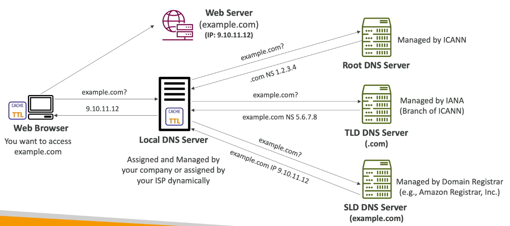

# DNS Servers: 
DNS servers perform the task of converting human readable website URLs into IP addresses. 

### Terms: 
- Domain Registrar: Services which host servers to convert URLs into IP addresses. Eg. AWS route 53, Go daddy, etc
- DNS records: records of many types(A, AAAA, NS, CNAME)
- Name Server: Resolves DNS Queries
- Zone File: Contains DNS records

### URL structutre: 
- Top level Domain: .com,.gov, .in etc
- second level domain: google.com, example.com 
- FQDN: fully qualified domain name, refers to domain names that can be converted into a singular IP address. 

# How DNS works: 
DNS lookup works by recrusively asking DNS servers for the IP address, till it arrives at a final IP. 

### DNS records
- DNS records consist of the following: 
    - Domain/sub-domain
    - Record type: A, AAAA, CNAME, NS 
    - Value: associated IP value 
    - Routing policy 
    - TTL: duration for which the record is cached by the browser
- DNS Record Types:
    - A : IPv4 address 
    - AAAA : IPv6 address 
    - CNAME : maps hostname to another hostname
    - NS : Name servers for the hosted zones 