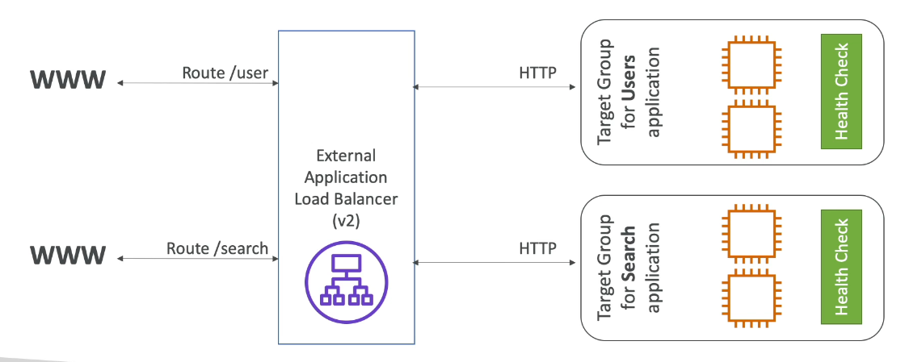

# Application load balancers: 
Layer 7 load balancer for balancing requests between multiple servers. ALB are a great fit for micro-services and container based applications. 

### Features:
- Layer 7 
- Load balancing to multiple HTTP applications accross machines(Target groups)
- Load balancing to multiple Applications on the same machine. 
- support for http/2 and webSocket 
- supports redirects (eg. HTTP to HTTPS)
- Port mapping feature(redirect to a dynamic port in ECS)

### **Routing options**:
- routing based on url paths
- based on hostname 
- based on Query string

### Target Groups: 
- EC2 W/WO ASG
- ECS
- Lmabda Functions
- IP addresses (Private IPs)

**Note**: 
- An ALB can balance traffic for multiple target groups 
- Health checks are at the target group level. 
- Applications servers do not see the IP of the client. 
- IP, Port and Protocol information is added by LB to the request headers. 
