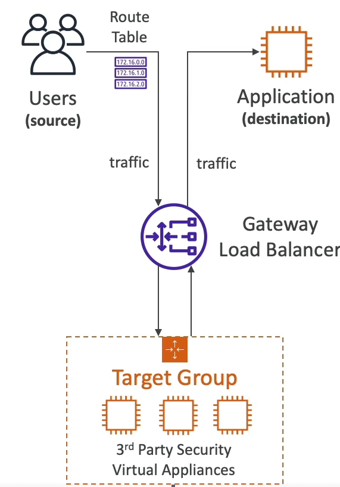

# Gateway Load Balancer: 
- Layer 3 load balancer. 
- Used to deploy scale and manage a fleet of 3rd party network virtual appliances. 
- Used to pass packets through a firewalls, Intrusion detection systems, Deep Packet inspections systems or for payload manipulation.
- Packets that do not pass inspection are dropped, only packets that pass are forwarded back
- GLB moves forwarded traffic to an application or an ALB/NLB. 
- The end reciever of the packet, does not see or know anything about the GLB inspection process. 
- Route tables are manipulated to achieve this. 
- Combines 2 functionalities to achieve this: 
    - Transparent Network Gateway: single entry and exit point for VPC 
    - Load balancer: Distributes traffic to Virtual appliances for inspection. 
- Uses GENEVE protocol on port 6081

