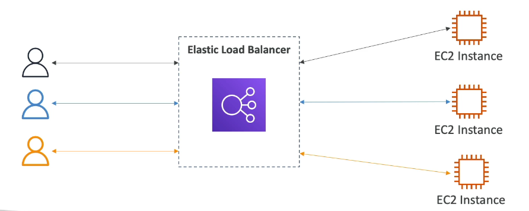

# **AWS Load Balancers: In-Depth Guide**

## **1. Overview of AWS Load Balancers**
AWS **Elastic Load Balancing (ELB)** is a fully managed service that **distributes incoming traffic** across multiple targets (EC2 instances, containers, Lambda functions) to **ensure high availability, fault tolerance, and scalability**.

AWS provides **four types of load balancers**:
1. **Application Load Balancer (ALB)**
2. **Network Load Balancer (NLB)**
3. **Gateway Load Balancer (GWLB)**
4. **Classic Load Balancer (CLB) [Legacy]**

## why use Load-balancers? 
- spread load across multiple downstream instances. 
- Expose a single access point (DNS) to your application. 
- Seamlessly handle failure
- Perform health checks
- enforce stickiness with cookies
- Provide SSL (HTTPS) termination for your website.
- high availability across AZs
- Seperate public traffic from private traffic.  

## Integrations:
- EC2
- ECS
- ASG
- CloudWatch
- Route53 
- WAF
- Global accelerator
- ACM 

**Sticky Sessions:** I
- Same client is directed to the same instance/target behind the backend 
- Implemented using cookies, cookie has an expiration date.  
- Ensures that user does not lose session data
- works with ALB, NLB & CLB
- Can lead to imbalanced balancing. 
- Two types of cookies: Application Based (Custom/Application) and Duration Based

**Cross zone load balancing:**
- Routing packets accross AZs to ensure equal distribution of packets, in case of uneven numbers of EC2 instances in AZs
- Enabled by default in ALB, No charges for AZ to AZ data transfer.
- Disables by default in NLB and GWLB, Charges for AZ to AZ data transfer
- CLB(retired) Disabled, No charges 

**SSL/TLS:**
- SSL certificate allows traffic between client and LB to be encrypted in transit(In-flight encryption)
- SSL refers to secure sockets layer
- TLS refers to Transport layer security 
- TLS is a newer version and is most commonly used. 
- SSL certs are issued by Certificate Authority (eg. Digicert, godaddy etc)
- SSL certificates needed for HTTPS(Green lock icon)
- Traffic between Client and LB is HTTPS over public internet
- LB performs SSL certificate termination
- Load balancer communicates with instance using HTTP(Not encrypted)
- LB uses X.509 SSL server certificate. 
- Certificates can be managed using ACM(AWS certificate manager)
- You can create and upload your own certificates. 
- If LB is HTTPS listener you must specify:
    - Default certificate 
    - Optional List of certificates to support multiple domains
    - Clients can use SNI to specify hostname they reach 
    - Set a specific security policy to support older version of SSL/TLS (Legacy Clients)

**SNI:** 
- Newer protocol to solve the problem of loading multiple Certs onto a single server. 
- requires client to indicate the hostname, and identifies the correct cert based on hostname 
- Only works with NLB/ALB 
- Does not work with CLB 

**Connection Draining / Deregistration Delay:** Provides a short window of time for inflight requests to be processed while
 an instance is being marked un-healthy. The LB stops sending new requests to the instance but allows inflight requests to
 be processed, before shutting down the instance completely. Connection draining can be set manualy(1-3600) with a default
calue of 300s

# **2. Key Benefits of AWS Load Balancing**
✅ **High Availability:** Automatically routes traffic to healthy targets.  
✅ **Scalability:** Dynamically adjusts to traffic demands.  
✅ **Fault Tolerance:** Detects and reroutes requests from unhealthy instances.  
✅ **Security:** Works with AWS Web Application Firewall (WAF), SSL/TLS encryption.  
✅ **Cost Optimization:** Supports auto-scaling and pay-as-you-go pricing.  

# **3. Types of AWS Load Balancers**
| Load Balancer Type | Best For | Layer | Protocols | Features |
|--------------------|---------|------|-----------|----------|
| **Application Load Balancer (ALB)** | Web applications, microservices, API gateways | Layer 7 (HTTP/HTTPS) | HTTP, HTTPS | Path-based routing, host-based routing, WebSockets, AWS WAF |
| **Network Load Balancer (NLB)** | High-performance, low-latency applications | Layer 4 (TCP/UDP) | TCP, UDP, TLS | Static IP, ultra-low latency, handles millions of requests per second |
| **Gateway Load Balancer (GWLB)** | Security appliances, firewalls, deep packet inspection | Layer 3 (IP) | IP packets | Transparent traffic inspection, integrates with 3rd-party appliances |
| **Classic Load Balancer (CLB) [Legacy]** | Older applications | Layer 4 & 7 | HTTP, HTTPS, TCP | Basic load balancing, SSL termination |

---

# **4. Application Load Balancer (ALB)**
### **4.1. Overview**
- **Operates at Layer 7 (Application Layer).**
- Routes requests based on HTTP headers, hostnames, query strings, and cookies.
- Best suited for **modern web applications, microservices, API Gateways.**

### **4.2. Key Features**
✅ **Path-Based Routing**: Directs traffic based on URL path (`/api`, `/images`).  
✅ **Host-Based Routing**: Routes requests to different targets based on the domain name (e.g., `api.example.com`, `app.example.com`).  
✅ **WebSockets Support**: Ideal for real-time applications like chat and notifications.  
✅ **AWS WAF Integration**: Protects against DDoS attacks and SQL injection.  
✅ **Authentication**: Integrates with AWS Cognito & OpenID providers.  

### **4.3. Use Cases**
- **Microservices architectures (ECS, Kubernetes)**
- **API Gateways**
- **Web applications with multiple subdomains (`blog.example.com`, `shop.example.com`)**

### **4.4. ALB Target Groups**
ALB routes requests to **target groups**, which can include:
- **EC2 Instances**
- **ECS Containers**
- **Lambda Functions**
- **IP Addresses**

---

# **5. Network Load Balancer (NLB)**
### **5.1. Overview**
- **Operates at Layer 4 (Transport Layer).**
- Handles **millions of requests per second** with **ultra-low latency**.
- Best for **high-performance applications, gaming, real-time trading, VoIP.**

### **5.2. Key Features**
✅ **TCP & UDP Support**: Supports applications requiring direct TCP/UDP communication.  
✅ **TLS Termination**: Offloads SSL decryption to improve instance performance.  
✅ **Static IP Addresses**: Each NLB gets a **fixed** Elastic IP.  
✅ **Zonal Isolation**: Traffic can be confined to a specific availability zone.  

### **5.3. Use Cases**
- **IoT applications** requiring low-latency communication.
- **Financial and gaming applications** that need real-time processing.
- **Load balancing across on-premise and AWS hybrid environments**.

### **5.4. NLB Target Groups**
- EC2 instances
- Containers (ECS, EKS)
- IP addresses

---

# **6. Gateway Load Balancer (GWLB)**
### **6.1. Overview**
- **Operates at Layer 3 (Network Layer).**
- Routes **entire IP packets** to 3rd-party security appliances.
- Best for **deep packet inspection, security, and firewall appliances.**

### **6.2. Key Features**
✅ **Third-Party Security Integrations** (Firewalls, IDS/IPS, DDoS protection).  
✅ **Transparent Packet Processing** (No changes required to source/destination IPs).  
✅ **High Availability and Scalability** for network security applications.  

### **6.3. Use Cases**
- **Next-gen firewalls and intrusion detection systems (IDS/IPS).**
- **Centralized security monitoring and compliance**.
- **Cloud-to-cloud or hybrid cloud security solutions**.

---

# **7. Classic Load Balancer (CLB) [Legacy]**
### **7.1. Overview**
- Operates at **Layer 4 & 7**.
- Older generation of AWS load balancers (being phased out).
- Limited to **basic load balancing for HTTP, HTTPS, and TCP applications**.

### **7.2. Use Cases**
- **Legacy applications that don’t need modern features** like host-based routing.
- **Basic web applications** requiring SSL termination.

---

# **8. Load Balancer Security Features**
### **8.1. SSL/TLS Encryption**
- Supports **SSL termination** (offloads SSL decryption).
- **ALB and NLB support AWS Certificate Manager (ACM)** for easy SSL management.

### **8.2. AWS WAF (Web Application Firewall)**
- Protects against **DDoS, SQL Injection, Cross-Site Scripting (XSS), and bot attacks**.
- Can be enabled with **Application Load Balancer (ALB).**

### **8.3. IAM and Security Groups**
- **Restrict access using IAM policies**.
- Use **VPC Security Groups** to allow only trusted IPs.

---

# **9. Monitoring and Logging**
### **9.1. Amazon CloudWatch Metrics**
- **RequestCount**: Number of incoming requests.
- **HealthyHostCount**: Number of healthy targets.
- **Latency**: Average response time.
- **HTTPCode_ELB_5XX**: Number of 5XX errors (server issues).

### **9.2. AWS Logs**
- **Access Logs**: Stores logs in **S3** for troubleshooting.
- **AWS CloudTrail**: Tracks API calls and security events.

---

# **10. Choosing the Right AWS Load Balancer**
| Use Case | Recommended Load Balancer |
|----------|----------------------------|
| **Web applications, microservices, API Gateway** | ALB (Application Load Balancer) |
| **High-performance, low-latency apps** | NLB (Network Load Balancer) |
| **Security appliances, firewall integration** | GWLB (Gateway Load Balancer) |
| **Basic legacy applications** | CLB (Classic Load Balancer) |

---

# **11. Pricing Model**
- **Pay-as-you-go pricing**, based on:
  - **Number of active connections** (NLB)
  - **New connections per second** (ALB)
  - **Processed GBs per hour**
- **ALB is more expensive than NLB** due to Layer 7 processing.

---

# **12. Conclusion**
AWS Load Balancers provide **scalable, high-performance traffic distribution** for applications.  
- **ALB:** Best for modern **web apps and APIs** (Layer 7).  
- **NLB:** Ideal for **high-performance, real-time applications** (Layer 4).  
- **GWLB:** Used for **network security and packet inspection** (Layer 3).  
- **CLB:** Legacy option, best avoided for new deployments.  

