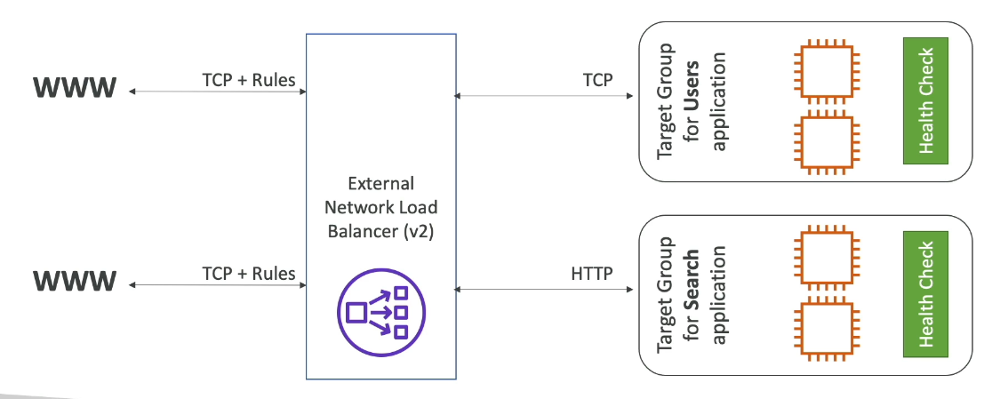

# Network Load Balancer: 
- Designed for balancing TCP/UDP pakcets and forward them to instances(Target groups)
- Layer 4 of OSI model.
- Very high performance (millions of requests/second)
- Ultra low latency 
- One static IP per AZ (Allows for better security, by allowing traffic from only 1 ip for every AZ)
- Not part of AWS free tier
- health checks are performed using TCP/HTTP/HTTPS 

### Target groups: 
- Ec2 instances 
- IP addresses (Private IPs)(hardcoded)
- NLB -> ALB (Useful to define the rules that are possible with ALB)

