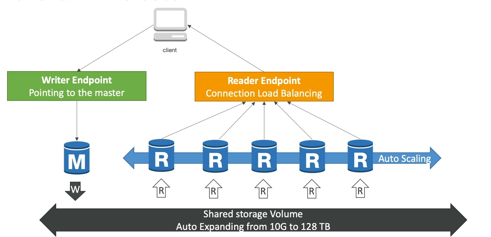

# Aurora: 
- Compatible with Postgres and MySql 
- AWS proprietary Cloud optimised
- can intract how you would normally interact with a normal postgres/mysql db 
- 5x performance over MySql 
- 3x performance over Potgres 
- Grows automatically with increments of 10GB 
- Maximum size of 128TB
- upto 15 read-replicas
- 20% more expensive 

### High Availability and Read Scaling features: 
- 6 copies of data accross 3Azs 
- Faster replication process with sub 10ms replication latency 
- Instantaneous failover, High availability
- can survive 1 AZ failure 
- 3 copies needed for reads 
- 4 copied needed for writes 
- Self healing for corrupt data through peer-to-peer replication 
- Storage is striped across 100s of volumes 
- One Aurora Instance takes writes 
- If intance fails, standby instance takes over in <30s
- 15 read-replicas for read scaling
- read-replicas can also take over as master 

### Aurora DB cluster: 
- Master writes to shared storage volume 
- Writer end-point(DNS), which always points to the master 
- In case of master faliure, writer endpoint automatically redirects traffic to failover 
- Read-replica auto-scaling supported 
- reader end-point balances read requests between read-replicas

## Advanced features: 
- Replica Auto-scaling
    - Allows auroa to automatically create new read replicas if read-load is too high 
    - Parameters like number of connections or cpu utilization can be used to define scaling policy 
    - writer endpoint balances load across replicas
- Custom endpoints: 
    - Allows you to create endpoints that redirect to specific read-replica or group of read replicas
    - useful if you have replicas with varying performance
    - reader endpoint is not generally used with custom endpoints 
- Aurora Serverlss: 
    - automated instantiation and scaling 
    - good for infrequent or intermittent use 
    - No capacity planning needed
    - Pay per second (more cost effective in somecases)
- Global Aurora: 
    - Cross region read replicas(simpler option for disater recovery ) 
    - Aurora Global Database
        - 1 primary region  
        - upto 5 secondary regions 
        - upto 16 read-replicas in secondary region
        - helps decrease latency 
        - Incase of region outage, another region can be promoted in under 1min 
        - cross region replication takes less than 1s 
- Aurora Machine learning
    - Aurora is integrated with ML services 
    - allows use of SQL for prediction 
    - AWS sagemaker 
    - AWS comprehend 
    - use cases: fraud detection, ads targeting, Sentiment analysis, product recommendations 
- Babelfish for Aurora Postgres: 
    - Allows postgres aurora to understand commands for MS SQL server(eg T-SQL)
    - removes burden of modifying application to work with postgres
    - babel fish allows application to communicate with aurora postgres db using T-SQL
    - Migrations using AWS SCT and DMS 

 