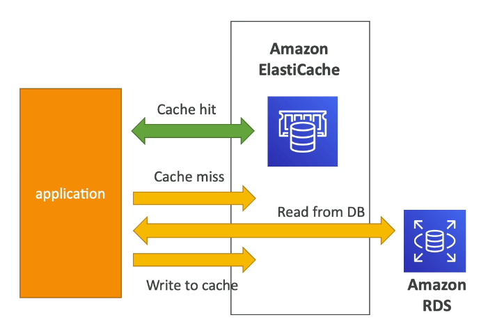
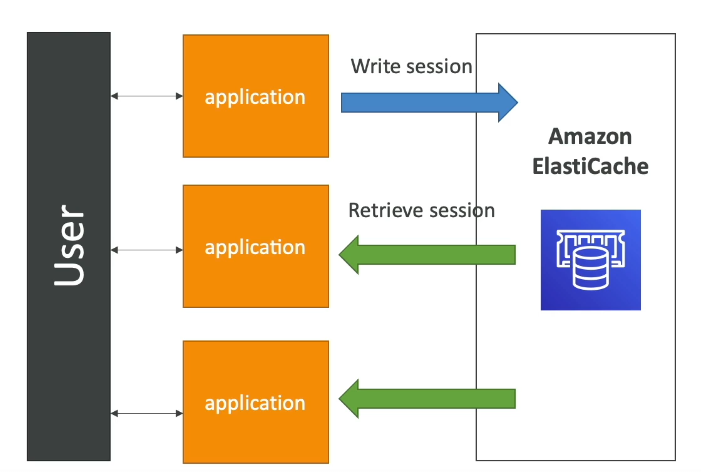

# elasticache
- managed AWS service for in-memory databases(Redis and Memchached)
- In-memory, high performance, low-latency 
- helps reduce read load on DBs for read intensive workloads 
- Helps make applications stateless 
- AWS takes care of OS maintainance/patching, updates, backups, optimizations, setups, configuration monitering, faliure recovery 
- Requires significant application code changes, application must query cache before caching DB 
- cache invalidation strategy is needed to ensure that only the most recent Data is available

  

### Session management
- Elasticache allows session data to be stored in the cache
- Stored session data retrieved from the cache, reduces need for user to login again and again.  
- allows users to switch between application instances 
- Load balancers do not need to use sticky sessions.
- Makes application stateless

### Redis:
- Supports Multi-AZ with auto failover 
- read-replicas to scale reads 
- Data durability using AOF persistence 
- backup and restore featutures 
- supports sets and soreted sets
- Security: 
    - Supports IAM authentication 
    - IAM policies are only used for AWS API level security 
    - Redis Auth: password/token + Security group + SSL (Inflight encryption)

### memcahched: 
- multi-node data partitioning (sharding)
- no high availability 
- No persistence, if lost entire cache is lost
- backup and restore (only for serverless memcached)
- multi-threaded architecture. 
- Security: Uses SASL based authentication

### Patterns for Elasticache: 
- Lazy Loading 
- Write Through 
- Session store(using TTL) 

