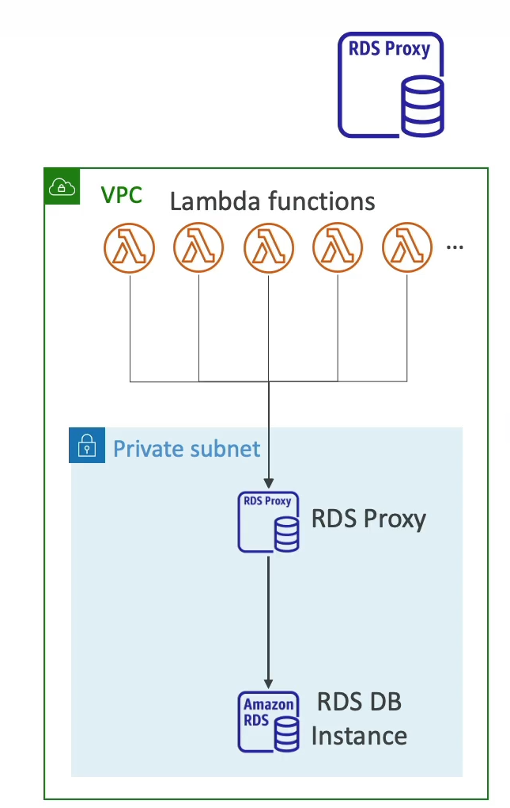

# RDS proxy:
- fully managed proxy service for RDS 
-  allows apps to pool and share db connections established with the DB 
- Improves DB efficency by reducing stress (RAM/CPU)
- Serverless and autoscaling 
- High availability 
- Reduced RDS and Aurora failover time by up to 66%
- Supports RDS(MySQL, Postgres, MariaDB, MS SQL server) and Aurora 
- No code changes required for most apps 
- Enforce IAM authentication for DB and securely store credentials using AWS secrets manager
- RDS proxy is never publicly available
- Must always connect through VPC
- Very useful for using AWS lambda and accessing DB.

